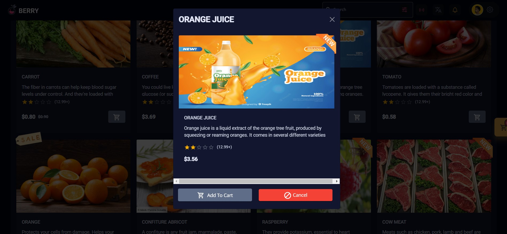

<h1 align="center">Berry Organic Shop
</h1>

 

<i>A curated list of awesome of my projects</i>

<i>Loved the project? Please consider [donating](https://paypal.me/mohamedarbani01) to help it improve!</i>

## Home Page

## Products Page

## Login Page

## Checkout Page

## Order Successfully Page

## Admin Dashboard Page

## Awesome Charts

## Create Banner Page

## Table Product Page

## Update Product Page

## Contribute

Contributions are always welcome!
Please read the [contribution guidelines](contributing.md) first.

## Special Thanks 🙇
- My team workers for making the amazing site for this repo!

## License

To the extent possible under law, [Mohamed Arbani](https://github.com/MohamedArbani) has waived all copyright and related or neighboring rights to this work.
